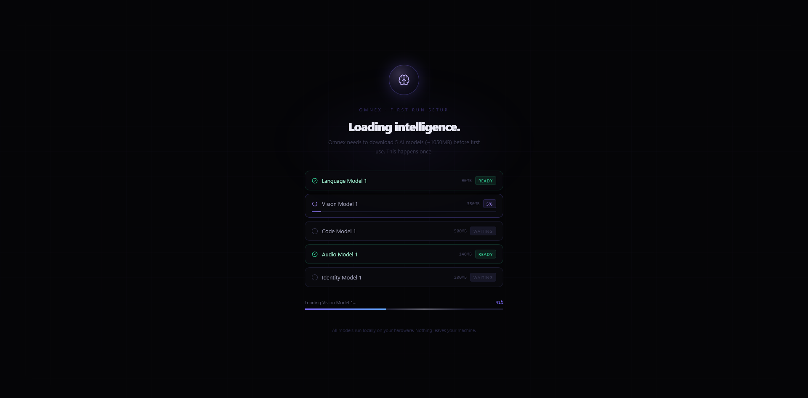

<div align="center">


### The AI Memory Layer for Your Personal Data

Index everything you have — documents, photos, video, audio, code — and recall it in plain language. No folders. No filenames. No keyword search. Just memory.

[](LICENSE)
[](https://github.com/sup3rus3r/omnex/stargazers)
[](https://github.com/sup3rus3r/omnex/network/members)
[](https://github.com/sup3rus3r/omnex/issues)
[](https://github.com/sponsors/sup3rus3r)
[](https://www.python.org/)
[](https://nextjs.org/)
[](https://fastapi.tiangolo.com/)
[](https://www.mongodb.com/)
[](https://www.docker.com/)
[](https://pytorch.org/)

---

**If you find this project useful, please consider giving it a star!** It helps others discover it and motivates continued development.

[**Give it a Star**](https://github.com/sup3rus3r/omnex) ⭐

</div>

---

## Table of Contents

- [Why Omnex?](#why-omnex)
- [Features](#features)
- [First Run](#first-run)
- [Quickstart](#quickstart)
- [Manual Install](#manual-install)
- [Tech Stack](#tech-stack)
- [Vision](#vision)
- [Current Status](#current-status)
- [Roadmap & Future Integrations](#roadmap--future-integrations)
- [Contributing](#contributing)
- [License](#license)

---

## Why Omnex?

The way humans store and retrieve personal data has not fundamentally changed since the 1970s. Files. Folders. Drives. You remember where you put things — or you don't. Search is keyword-based. Video and audio are completely unsearchable. Your data has no intelligence.

**Omnex changes this at the foundation.**

> *"Find the contract I signed around the time we moved."*
> *"Show me photos with my sister from the Cape Town trip."*
> *"Pull up the code I wrote for authentication last year."*
> *"What was I working on the week before the product launch?"*
> *"Photos from my iPhone taken last summer."*
> *"Documents from March 2023 about the project handover."*

These are not search queries. They are memories. Omnex retrieves them.

- **No cloud dependency** — All models, processing, and storage run on your hardware. Your data never leaves your machine.
- **Every file type** — Documents, PDFs, images, video, audio, code, spreadsheets, presentations. If it exists on your drive, Omnex understands it.
- **Agent-ready API** — The same backend humans query, AI agents can call. Claude, GPT, and custom agents get a structured memory API out of the box.
- **Self-hosted and open source** — AGPL-3.0. No telemetry. No lock-in. Runs entirely on your own hardware.

---

## Features

### Semantic Text & Document Indexing

Documents, PDFs, Markdown, Word, Excel, PowerPoint, HTML, and plain text are chunked, embedded with MiniLM (384-dim), and stored in the vector index. Query by meaning, not keyword.

### Image Understanding

Images are embedded with CLIP (ViT-B/32). EXIF metadata, timestamps, GPS coordinates, and device information are extracted and indexed alongside the visual embedding. Thumbnails are generated for every image.

### Audio & Video Transcription

Audio and video files are transcribed with Whisper (base). Transcripts are chunked by segment with timestamps, embedded with MiniLM, and indexed — making every spoken word searchable.

### Video Keyframe Analysis

Video keyframes are extracted and embedded with CLIP, giving Omnex visual understanding of video content independent of the audio track.

### Code Understanding

Source code is indexed with CodeBERT embeddings (768-dim). Functions, classes, and symbol metadata are extracted and stored — enabling semantic code search across your entire codebase.

### Face Detection & Identity Clustering

Faces in photos and video are detected with InsightFace (ArcFace, 512-dim embeddings) and clustered into identities with DBSCAN. Name an identity once, recall by person forever.

### Neural Auto-Tagger

Every chunk is automatically tagged during ingestion: `year-*`, `month-*`, `season-*`, `topic-*`, `scene-*`, `location-gps`, `lang-*`, `format-*`, `temporal-*`, `size-*`. Images and video are tagged using CLIP zero-shot scoring against 15 scene categories. Documents and audio use keyword matching. No manual labelling required.

### Natural Language Query Engine

Queries are parsed into multi-stage vector searches across all indexes (text, image, audio, video, code), then filtered by metadata — date ranges, file type, device name, GPS region, language, and tags. A MongoDB fallback handles broad and temporal queries ("what did I work on recently?") so the LLM always gets real data to reason about. An LLM then acts as an intelligent post-filter, selecting only the genuinely relevant results before responding.

### Temporal & Metadata Queries

The query engine extracts structured signals from natural language: device names ("iPhone", "Canon", "Pixel"), date ranges ("last week", "March 2023", "3 months ago"), file type hints ("my PDFs", "spreadsheets", "MP3s"), topic tags, and GPS region filters. These are applied as MongoDB match conditions alongside the vector search.

### File Watcher — Incremental Indexing

Point Omnex at a folder and it watches it continuously using `watchdog`. New files are indexed automatically as they appear. Modified files are re-indexed. Deleted or moved files are removed from the index. A 3-second debounce prevents re-indexing files that are still being written. Watched folders persist across restarts — they are stored in MongoDB and re-started automatically when the API comes back up. Manage watched folders directly from the Ingest panel — add a path, see live status (green dot = active), and stop watching with one click.

### Conversational Memory

Every session persists in MongoDB. The last 10 conversation turns are passed as history to every LLM call, enabling coherent multi-turn dialogue about your data. Ask follow-up questions, refine results, or switch topics naturally.

### Multi-Provider LLM Support

| Provider | Models | Type |
|---|---|---|
| **Anthropic** | Claude Sonnet 4.6, Claude Opus 4.6, Claude Haiku 4.5 | Cloud |
| **OpenAI** | GPT-4o, GPT-4o-mini | Cloud |
| **Ollama** | Phi-3, Gemma 3, Llama 3.2 — any local model | Local |

### Voice Input & TTS Output

Voice input uses local Whisper running on-device — press to speak or hold for always-listening Jarvis mode with automatic voice activity detection. Voice output uses **Chatterbox Turbo** (ResembleAI, ~200ms latency, expressive paralinguistic tags, GPU) as the primary engine, with **Kokoro ONNX** as the CPU fallback. Both engines are selectable in the Settings panel at runtime — no restart needed. The LLM uses Chatterbox's expressive tags (`[laugh]`, `[sigh]`, `[chuckle]`, etc.) naturally in responses; tags are sent to TTS but stripped from the chat display. No cloud voice dependency of any kind.

### Agentic Query Engine (LangGraph)

Every query runs through a LangGraph state graph with conditional routing. A classify node makes a single fast LLM call (64 tokens) to decide whether the query needs a data search or is pure conversation — avoiding unnecessary index access for greetings and chitchat. Search queries flow through vector search, single-source document expansion (full doc context for the LLM), and a final LLM answer node. Conversational queries skip the index entirely and go straight to a chat node.

### Remote Access & Agent API

An ngrok tunnel exposes Omnex to the internet with optional API key auth. A JSON-RPC 2.0 MCP server at `/mcp` makes Omnex callable from Claude Desktop, Cursor, Windsurf, or any MCP-compatible agent. Media URLs are HMAC-signed with configurable expiry.

### FUSE Virtual Filesystem

Omnex mounts as a real directory tree at `/mnt/omnex` (Linux/WSL). Browse your indexed data as files — `documents/`, `images/`, `audio/`, `video/`, `code/`, `by_date/YYYY/MM/`. A magic `search/` directory lets any app query Omnex by reading a file named after the query. Write a file to the virtual drive and it is automatically ingested. Delete a file from the virtual drive and it is removed from the index.

### People View

Faces in photos are detected, clustered, and displayed in a dedicated People view. See all photos of each person in a grid, name them with a single click, and query by person name in natural language.

### Timeline View

Browse your entire indexed history by year and month. One card per source file — showing file type, date, and chunk count. Filter by type. Delete directly from the timeline. A paginated visual map of everything Omnex knows about, organised by when it happened.

### Resizable Preview Pane

A persistent preview pane sits beside all views — Recall, Timeline, and beyond. Drag to resize. Previews images, plays audio and video, renders document text, and shows chunk metadata. Available from every view, not just search.

### Agent Memory Write API

AI agents can store observations directly into the Omnex index. Register an agent via `POST /agents`, then push text memories via `POST /agents/observe` or the MCP `omnex_remember` tool. Every agent-written chunk is tagged with the agent identity and surfaces in search results under a dedicated "Agent Memory" section with a purple brain badge. The `X-Agent-ID` header in MCP config enables Claude Desktop, Cursor, and Windsurf to call `omnex_remember` directly.

### Delete & Manage Index

Remove indexed data directly from the UI — delete a source file from the Ingest panel, the Timeline view, or the Recall results. Full control over what stays in your memory.

---

## First Run

<div align="center">

</div>

On first launch, Omnex downloads the required AI models (~1.4 GB total). This happens once. All models are cached in a Docker volume and loaded on every subsequent start. No internet connection required after setup.

| Model | Purpose | Size |
|---|---|---|
| Language Model | Text embeddings (MiniLM) | ~90 MB |
| Vision Model | Image + video embeddings (CLIP) | ~350 MB |
| Code Model | Code understanding (CodeBERT) | ~500 MB |
| Audio Model | Speech transcription (Whisper) | ~140 MB |
| Identity Model | Face detection + clustering (InsightFace) | ~320 MB |

---

## Quickstart

**The only prerequisite is [Docker Desktop](https://www.docker.com/products/docker-desktop/).**

**1. Clone**

```bash
git clone https://github.com/sup3rus3r/omnex
cd omnex
```

**2. Configure**

Create `.env` in the project root:

```bash
LLM_PROVIDER=anthropic
ANTHROPIC_API_KEY=your_key_here
ANTHROPIC_MODEL=claude-sonnet-4-6
```

**3. Start**

```bash
docker compose up --build
```

First build downloads PyTorch and all ML dependencies (~2–3 GB, ~10–15 minutes). Subsequent starts take seconds.

**4. Open**

| Service | URL |
|---|---|
| UI | [http://localhost:3007](http://localhost:3007) |
| API | [http://localhost:8001](http://localhost:8001) |
| API docs | [http://localhost:8001/docs](http://localhost:8001/docs) |

Navigate to **Ingest** in the sidebar, drop files or a folder, and click **Start ingestion**. Then switch to **Recall** and start querying.

---

## Manual Install

> For contributors developing the Python backend. Docker is strongly recommended for all other use cases — it eliminates all platform-specific dependency issues on Windows.

**Prerequisites:** Python 3.11+, Node.js 20+, MongoDB 7.0 on port 27017

```bash
git clone https://github.com/sup3rus3r/omnex
cd omnex
python -m venv .venv
```

```bash
# Windows — from a plain PowerShell (no conda/Anaconda active)
.venv\Scripts\pip install torch==2.5.1 --index-url https://download.pytorch.org/whl/cu124
.venv\Scripts\pip install -r requirements.txt
.venv\Scripts\pip install insightface onnxruntime-gpu
```

```bash
# Linux/macOS
.venv/bin/pip install torch==2.5.1 --index-url https://download.pytorch.org/whl/cpu
.venv/bin/pip install -r requirements.txt
.venv/bin/pip install insightface onnxruntime
```

```bash
cd interface && npm install && cd ..
```

Create `interface/.env.local`:

```
NEXT_PUBLIC_API_URL=http://127.0.0.1:8001
LLM_PROVIDER=anthropic
ANTHROPIC_API_KEY=your_key_here
ANTHROPIC_MODEL=claude-sonnet-4-6
```

```bash
# Terminal 1 — API (plain PowerShell, not Anaconda)
.venv\Scripts\python.exe -m uvicorn api.main:app --host 127.0.0.1 --port 8001

# Terminal 2 — UI
cd interface && npm run dev
```

### Troubleshooting

**"DLL load failed" / torch crash on Windows**
Anaconda is on your PATH. Open a plain PowerShell and restart the API. Or use Docker.

**"torch 2.11.0" / broken torch version**
`uv` auto-resolved to a broken version. Fix:
```
.venv\Scripts\pip install torch==2.5.1 --index-url https://download.pytorch.org/whl/cu124
```

**"InsightFace not installed: Unable to import onnxruntime"**
```
.venv\Scripts\pip install insightface onnxruntime-gpu
```

**Ingestion stuck at "Running" forever**
On Windows with Anaconda on PATH, sentence_transformers crashes silently. Use Docker. Without Anaconda, the first ingestion takes ~30s to load the model cold.

**MongoDB connection error**
Check: `mongosh --eval "db.adminCommand('ping')"`. With Docker, no local MongoDB needed.

---

## Tech Stack

| Layer | Technology |
|---|---|
| Backend | Python 3.11, FastAPI, Uvicorn |
| Text Embeddings | sentence-transformers — MiniLM-L6-v2 (384-dim) |
| Image / Video Embeddings | CLIP ViT-B/32 (512-dim) |
| Audio Transcription | OpenAI Whisper (base) |
| Code Embeddings | CodeBERT (768-dim) |
| Face Detection | InsightFace — ArcFace buffalo_l (512-dim) |
| Vector Index | USearch — file-based, i8 quantized (~4x storage savings vs float32) |
| Metadata Store | MongoDB 7 |
| Binary Store | Content-addressed chunk store |
| Frontend | Next.js 14, React 18, TypeScript, Framer Motion |
| LLM | Anthropic / OpenAI / Ollama (configurable) |
| Query Engine | LangGraph state graph — classify → search/chat routing |
| TTS | Chatterbox Turbo (GPU, expressive) / Kokoro ONNX (CPU fallback) |
| Voice Input | OpenAI Whisper (local, on-device) |
| Remote Access | ngrok tunnel + MCP JSON-RPC 2.0 server |
| Virtual Filesystem | FUSE / fusepy — read-write virtual drive (Linux/WSL) |
| Infrastructure | Docker Compose |

---

## Vision

We are at an inflection point. AI agents are becoming capable of acting on our behalf — scheduling, researching, deciding, creating. For this to work, the underlying data layer needs to be rebuilt from scratch. Not a keyword search engine with an AI coat of paint. A genuine memory substrate — one that humans and agents share equally.

**Omnex is that substrate.**

The roadmap from today to where this ends up:

| Stage | What it means | Status |
|---|---|---|
| **Personal memory** | Single user. All file types. Semantic recall across everything you have. | Now |
| **Agent memory** | AI agents read and write to your Omnex index. Human and agent share one memory. | Now |
| **Multi-agent substrate** | A swarm of specialised agents operates on a shared Omnex instance. Collective intelligence across a team or organisation. | Planned |
| **Federated hivemind** | Multiple Omnex instances with opted-in sharing. Distributed semantic memory across users, devices, organisations. | Planned |
| **AI OS layer** | Omnex mounts as a FUSE virtual filesystem. `People/Sarah/`, `Places/Cape Town/`, `By Year/2023/` are generated from the semantic index, not physical directories. The traditional file system is legacy. | Planned |

The architecture for the first two stages is being built now. The API agents will call is the same API humans use today. The foundation does not change — the scale does.

Big tech will build their version of this. It will be cloud-first, walled-garden, and trained on your data without your meaningful consent. That version already exists in pieces — Google Photos, iCloud, Microsoft Recall. Siloed, proprietary, not agentic.

Omnex is the open alternative. Local. Private. Agentic-ready. Built for humans and agents equally.

**The file system had a good run. Help us build what comes next.**

---

## Current Status

| Phase | Milestone | Status |
|---|---|---|
| 0 | Foundation — repo, Docker, installers | ✅ |
| 1 | Text + document ingestion | ✅ |
| 2 | Image ingestion + CLIP embeddings | ✅ |
| 3 | Query engine + UI + voice input | ✅ |
| 4 | Face clustering + identity | ✅ |
| 5 | Audio + video ingestion | ✅ |
| 6 | Code ingestion + CodeBERT | ✅ |
| 7 | Neural auto-tagger | ✅ |
| 8 | File watcher — incremental indexing + UI + persistent across restarts | ✅ |
| 9 | LLM chat layer + session memory + streaming TTS | ✅ |
| 10 | Remote access — MCP server + ngrok + API keys + signed URLs | ✅ |
| 11 | FUSE virtual filesystem — read | ✅ |
| 12 | FUSE filesystem — write + sync | ✅ |
| 13 | Local Whisper voice + always-listen VAD mode | ✅ |
| 14 | People view + Timeline view + Delete UI + Settings | ✅ |
| 15 | Progressive UX — cold start + drive expansion | ✅ |
| 16 | Multi-agent write API — agents store observations into index | ✅ |
| 17 | Temporal + metadata query engine — device, GPS, date, tag filters | ✅ |

Full architecture: [docs/ARCHITECTURE.md](docs/ARCHITECTURE.md) · Build plan: [docs/BUILDPLAN.md](docs/BUILDPLAN.md) · Implementation reference: [docs/TECHDOC.md](docs/TECHDOC.md)

---

## Roadmap & Future Integrations

Everything built so far indexes data that lives on your local machine. The next frontier is pulling in the rest of your digital life — the data that currently lives in silos across the internet — and making it all part of the same searchable, queryable memory.

### Cloud Storage

Sync and index files directly from cloud drives without downloading them manually.

| Integration | What gets indexed |
|---|---|
| Google Drive | Docs, Sheets, Slides, PDFs, images — full content + metadata |
| OneDrive / SharePoint | Office documents, files, shared drives |
| Dropbox | All file types — same pipeline as local ingestion |
| iCloud Drive | Photos, documents, Notes |
| Box | Business documents and shared content |

### Email

Your inbox is one of the richest sources of personal memory — conversations, attachments, decisions, relationships. All of it searchable.

| Integration | What gets indexed |
|---|---|
| Gmail | Email body, subject, sender, thread, attachments |
| Outlook / Microsoft 365 | Same — plus calendar events and meeting notes |
| IMAP / generic | Any email provider via standard IMAP protocol |

### Calendars

Turn your calendar history into queryable context — "what was I doing the week of the product launch?" becomes answerable.

| Integration | What gets indexed |
|---|---|
| Google Calendar | Events, attendees, descriptions, recurrence |
| Outlook Calendar | Same |
| Apple Calendar | Same |

### Social & Messaging

The conversations you have every day — DMs, group chats, posts — contain a huge amount of personal context that is currently locked away.

| Integration | What gets indexed |
|---|---|
| WhatsApp | Messages, media, group conversations |
| Telegram | Messages, channels, files |
| Slack | Messages, threads, files, channel history |
| Discord | Server messages, DMs, shared media |
| iMessage | Conversations and media |
| Twitter / X | Tweets, bookmarks, DMs |
| LinkedIn | Posts, messages, saved articles |
| Instagram | Captions, DMs, saved posts |

### Productivity & Notes

Everything you capture during work — notes, tasks, wikis, bookmarks — indexed as a unified knowledge base.

| Integration | What gets indexed |
|---|---|
| Notion | Pages, databases, notes, linked content |
| Obsidian | Vault notes, tags, graph links |
| Evernote | Notes, notebooks, web clips |
| Roam Research | Pages, blocks, daily notes |
| Apple Notes | Notes and attachments |
| Todoist / Linear / Jira | Tasks, tickets, project history |
| Browser bookmarks | Page titles, URLs, saved content |

### Development & Code

Your entire software history — repos, issues, reviews, deployments.

| Integration | What gets indexed |
|---|---|
| GitHub / GitLab | Repos, commits, issues, PRs, comments |
| Jira | Tickets, sprints, comments, attachments |
| Confluence | Wiki pages and documentation |
| Figma | File names, frames, comments |

### Health & Fitness

Quantified self data — activity, sleep, vitals — all queryable alongside everything else.

| Integration | What gets indexed |
|---|---|
| Apple Health | Steps, sleep, heart rate, workouts |
| Google Fit | Activity and health metrics |
| Strava | Runs, rides, activities, routes |
| Oura / Whoop | Sleep stages, recovery scores, HRV |
| Fitbit | Activity, sleep, nutrition logs |

### Financial

Receipts, transactions, and financial documents — query your spending history in natural language.

| Integration | What gets indexed |
|---|---|
| Bank statements (PDF/CSV) | Transactions, merchants, amounts, dates |
| Receipts | OCR extraction of items, amounts, stores |
| Crypto wallets | Transaction history |

### Reading & Media

The content you consume — articles, books, podcasts, videos — made searchable and recallable.

| Integration | What gets indexed |
|---|---|
| Kindle / Apple Books | Highlights, annotations, reading history |
| Pocket / Instapaper | Saved articles, highlights |
| Spotify | Listening history, playlists, podcast episodes |
| YouTube watch history | Video titles, descriptions, transcripts (via captions) |
| Readwise | All highlights and reader notes |

---

### The Architecture for Integrations

Each integration will follow the same pattern as local ingestion — a connector pulls content, normalises it into the standard chunk schema, runs it through the existing embedding pipeline, and stores it in MongoDB + the vector index. The query engine does not change. You query across everything — local files, email, Slack, GitHub — with the same natural language interface.

Connectors will be opt-in, credentials stored locally, OAuth tokens encrypted at rest. No data ever routes through a cloud intermediary. The ingestion happens on your machine.

---

## Contributing

Omnex is open source and actively looking for contributors. We are building something that does not exist yet — not another CRUD app, not another wrapper around someone else's API.

**We need people across:**

- **Python** — ingestion pipeline, ML model integration, FastAPI backend
- **ML engineering** — embedding pipelines, model optimisation, quantization
- **Go** — FUSE virtual filesystem, OS-level integration
- **TypeScript / React** — UI, voice interface, real-time dashboard
- **NLP** — query parsing, result re-ranking, cross-encoder retrieval
- **DevOps** — packaging, Linux, Windows, macOS

**To get started:**

1. Read [docs/ARCHITECTURE.md](docs/ARCHITECTURE.md) — understand the system before writing code
2. Read [docs/BUILDPLAN.md](docs/BUILDPLAN.md) — find the phase that matches your skills
3. [Open an issue](https://github.com/sup3rus3r/omnex/issues) — introduce yourself, tell us what you want to build
4. Look for `good-first-issue` labels for well-scoped starting points

---

## License

Omnex is licensed under the **GNU Affero General Public License v3.0 (AGPL-3.0)**.

Use it, modify it, deploy it. If you run a modified version as a service, open source your changes. The project stays open — forever.

---

<div align="center">

*[github.com/sup3rus3r/omnex](https://github.com/sup3rus3r/omnex)*

*Local-first · Open source · Agentic-ready · AGPL-3.0*

</div>
