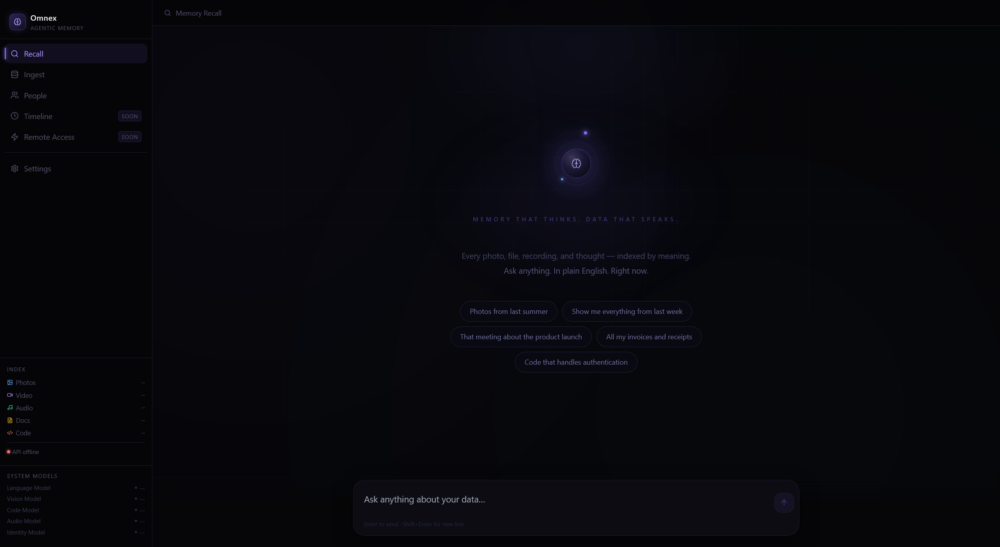

<div align="center">



### Open Source AI Memory Layer — Index Everything, Recall Anything

**These are not search queries. They are memories.**

> *"Find the contract I signed around the time we moved."*
> *"Show me photos with my sister from the last holiday trip."*
> *"Pull up the authentication code I wrote last year."*
> *"What was I working on the week before the product launch?"*

Omnex indexes every file you own — documents, photos, video, audio, code — and lets you recall any of it in plain language. Entirely on your hardware. No cloud. No keywords. No folders.

[](LICENSE)
[](https://github.com/sup3rus3r/omnex/stargazers)
[](https://github.com/sup3rus3r/omnex/network/members)
[](https://github.com/sup3rus3r/omnex/issues)
[](https://github.com/sponsors/sup3rus3r)
[](https://www.python.org/)
[](https://nextjs.org/)
[](https://fastapi.tiangolo.com/)
[](https://www.mongodb.com/)
[](https://www.docker.com/)
[](https://pytorch.org/)

---

**If Omnex solves a problem you have, please give it a star.** It helps others find it.

[**Star on GitHub**](https://github.com/sup3rus3r/omnex) ⭐

</div>

---

## Table of Contents

- [What is Omnex?](#what-is-omnex)
- [Why Omnex?](#why-omnex)
- [Quickstart](#quickstart)
- [Capabilities](#capabilities)
- [How It Works — Architecture](#how-it-works--architecture)
- [AI Models Powering Omnex](#ai-models-powering-omnex)
- [Agent & Federation API](#agent--federation-api)
- [Vision — The AI Memory OS](#vision--the-ai-memory-os)
- [Roadmap & Future Integrations](#roadmap--future-integrations)
- [Manual Install](#manual-install)
- [Contributing](#contributing)
- [License](#license)

---

## What is Omnex?

**Omnex is an open source, self-hosted AI memory layer for personal and organisational data.**

It runs entirely on your hardware. No cloud APIs are required for indexing or search. All embeddings, transcriptions, tagging, and vector search happen locally — on your GPU or CPU. Your data never leaves your machine.

Omnex indexes everything:

- **Documents** — PDF, Word, Excel, PowerPoint, Markdown, HTML, plain text
- **Images** — JPEG, PNG, RAW, HEIC — visual embeddings (CLIP) + face identity (InsightFace) + AI captions (moondream2)
- **Audio** — MP3, WAV, FLAC, AAC — transcribed with Whisper, every spoken word indexed
- **Video** — MP4, MOV, AVI — transcribed + keyframes embedded with CLIP
- **Code** — any source file — semantic embeddings with CodeBERT, symbol extraction

Omnex is also an **agentic memory platform**. AI agents — Claude, GPT-4, Cursor, Windsurf, any MCP-compatible tool — can read from and write to the same index humans use. Register an agent, push observations via the REST API or MCP protocol, and the agent's memory becomes part of the shared index. Multiple Omnex instances can federate into a distributed memory network — a hivemind for agent swarms.

---

## Why Omnex?

The existing options all have the same problem: they're either cloud-first, siloed, or not agentic.

|  | Omnex | Google Photos | Apple Recall | RAG frameworks |
|---|---|---|---|---|
| Fully local / private | ✅ | ❌ | ❌ | ✅ |
| All file types (docs, audio, video, code) | ✅ | ❌ | Partial | ❌ |
| Natural language recall | ✅ | Partial | ✅ | ✅ |
| AI agents share the same memory | ✅ | ❌ | ❌ | ❌ |
| Federated across machines / orgs | ✅ | ❌ | ❌ | ❌ |
| Open source | ✅ | ❌ | ❌ | ✅ |
| Self-hosted, one command | ✅ | ❌ | ❌ | ❌ |

The agent memory angle is the part that doesn't exist elsewhere. Your AI agents (Claude, Cursor, Windsurf) write observations, decisions, and research into the same index you search as a human. One memory layer — shared between you and every agent working on your behalf.

---

## Quickstart

**The only prerequisite is [Docker Desktop](https://www.docker.com/products/docker-desktop/).**

**1. Clone**

```bash
git clone https://github.com/sup3rus3r/omnex
cd omnex
```

**2. Configure**

Create `.env` in the project root:

```bash
LLM_PROVIDER=anthropic
ANTHROPIC_API_KEY=your_key_here
ANTHROPIC_MODEL=claude-sonnet-4-6
```

**3. Start**

```bash
docker compose up --build -d
```

First build downloads PyTorch and all ML dependencies (~2–3 GB, ~10–15 minutes). Subsequent starts take seconds.

> **Using a local LLM (Ollama)?** The Ollama container is opt-in — it only starts when you explicitly enable the `local` profile:
> ```bash
> docker compose --profile local up --build -d
> ```
> If you are using `LLM_PROVIDER=anthropic` or `LLM_PROVIDER=openai`, skip the `--profile local` flag entirely. Ollama will not start.

**4. Open**

| Service | URL |
|---|---|
| UI | [http://localhost:3007](http://localhost:3007) |
| API | [http://localhost:8001](http://localhost:8001) |
| API docs | [http://localhost:8001/docs](http://localhost:8001/docs) |

Navigate to **Ingest** in the sidebar, drop files or a folder, and click **Start ingestion**. Then switch to **Recall** and start querying.

---

## Capabilities

### Semantic Vector Search Across All Data Types

Every ingested file is split into chunks, embedded with the appropriate model for its type, and stored in a USearch i8-quantised vector index. Queries are embedded with the same model and scored by cosine similarity. The query engine runs a LangGraph state graph: index is always searched first; if the top result scores ≥ 0.20, the engine expands the full source document and passes it to the LLM answer node; below threshold, the query routes to a conversational chat node. No LLM classifier — no misrouting.

### Deep Semantic Tagging at Ingestion

Every chunk is enriched by a three-tier semantic tagging pipeline during ingestion:

- **Tier 1 — synchronous** (hot path, zero added latency): spaCy NER extracts people, organisations, and locations. fastText identifies language across 176 languages. KeyBERT extracts the top semantic keywords from each chunk. MiniLM zero-shot classifies document type — contract, resume, report, invoice, email, code, technical documentation, and more.
- **Tier 2 — async text enrichment** (background, post-index): GLiNER (`urchade/gliner_medium-v2.1`, ONNX, 188 MB) performs zero-shot named entity extraction with custom entity types, writing results to `metadata.gliner_entities`.
- **Tier 3 — async image captioning** (background): moondream2 (4-bit quantised, ~1 GB) generates a natural-language description of every image and writes it to `text_content`, making images text-searchable by what they actually depict — not just EXIF metadata.

No manual labelling. No separate pipeline. Rich metadata for every chunk, automatically.

### Natural Language Query Engine with Dynamic Filters

The query engine extracts structured signals from natural language before searching: device names ("iPhone", "Canon EOS"), date ranges ("last week", "March 2023", "3 months ago"), file type hints ("my PDFs", "MP3s"), topic tags, and GPS region filters. These become MongoDB match conditions applied alongside the vector search.

After every answer, the LLM emits structured `FILTERS` output — but only when it can confirm those filters are meaningful for the data it just retrieved. Filter chips in the UI are AI-generated and context-aware. No hardcoded filters. No dead-end refinements.

### Face Detection, Clustering & Identity

Faces in photos and video frames are detected and embedded with InsightFace (ArcFace buffalo_l, 512-dim). Identities are clustered with DBSCAN across your entire photo library. Name a cluster once — recall every photo of that person forever with a natural language query like "photos of Sarah from last summer".

### Voice-First Interface

Voice input runs on local Whisper — press to speak or hold for always-listening Jarvis mode with automatic voice activity detection. Voice output uses Chatterbox Turbo (ResembleAI, GPU, ~200ms latency) with expressive paralinguistic tags (`[laugh]`, `[sigh]`, `[chuckle]`), with Kokoro ONNX as the CPU fallback. Both engines are selectable in the Settings panel at runtime. No cloud voice dependency.

### Real-Time File Watcher

Point Omnex at any folder and it watches continuously with `watchdog`. New files are indexed automatically. Modified files are re-indexed. Deleted files are removed from the index. A 3-second debounce handles files still being written. Watched folders persist across restarts — stored in MongoDB and re-enabled automatically on startup.

### Conversational Session Memory

Every session is stored in MongoDB. The last 10 conversation turns are included in every LLM call — enabling coherent multi-turn dialogue, follow-up questions, and topic continuity across an entire session.

### FUSE Virtual Filesystem

Omnex mounts as a read-write virtual directory at `/mnt/omnex` (Linux/WSL). Browse indexed data as `documents/`, `images/`, `audio/`, `video/`, `code/`, `by_date/YYYY/MM/`. A magic `search/` directory lets any application query Omnex by reading a file named after the query. Write to the virtual drive — the file is ingested. Delete from it — the chunk is removed.

### Multi-Provider LLM Support

| Provider | Models | Type |
|---|---|---|
| **Anthropic** | Claude Sonnet 4.6, Claude Opus 4.6, Claude Haiku 4.5 | Cloud |
| **OpenAI** | >= GPT-4 | Cloud |
| **Ollama** | Phi-3, Gemma 3, Llama 3.2 — any local model | Local |

Switch providers at runtime from the Settings panel. No restart needed.

---

## How It Works — Architecture

```
Your files (docs, photos, audio, video, code)
        │
        ▼
   [ Omnex Ingest ]
        │  embeddings + tagging + transcription — all local
        ▼
   [ Memory Index ]  ◄──── AI agents write here too (MCP / REST)
        │
        ▼
   [ Query Engine ]
        │  natural language in → structured answer out
        ▼
  "Here's the contract from March 2023 about the handover..."
```

```
Ingestion Pipeline
──────────────────
File → type detector → chunker → embedding model (MiniLM / CLIP / CodeBERT / Whisper)
     → semantic tagger (spaCy + fastText + KeyBERT + GLiNER + moondream2)
     → USearch vector index + MongoDB metadata store
     → async deep enrichment (GLiNER entities / moondream captions)

Query Engine (LangGraph StateGraph)
────────────────────────────────────
Input → search_index (USearch cosine similarity)
      → score_route (≥ 0.20 → expand_doc → LLM answer | < 0.20 → chat)
      → structured output: RELEVANT_IDS + RESPONSE + FILTERS
      → dynamic filter chips (only emitted when filters are confirmed meaningful)

Agent & Federation Layer
─────────────────────────
POST /agents/observe  → local index + optional broadcast to federation peers
POST /federation/search → concurrent fan-out to all active peers, merge by score
MCP /mcp (JSON-RPC 2.0) → omnex_search, omnex_remember (broadcast), omnex_search_federated
```

Every component runs locally. The vector index, metadata store, embedding models, LLM (if Ollama), tagging models, TTS engine, and voice input model all run on your hardware. Cloud LLM providers (Anthropic, OpenAI) are optional and only used for the answer node — no data is sent for indexing or search.

---

## AI Models Powering Omnex

| Model | Purpose | Size |
|---|---|---|
| MiniLM-L6-v2 (sentence-transformers) | Text + document embeddings (384-dim) | ~90 MB |
| CLIP ViT-B/32 | Image, video keyframe embeddings (512-dim) | ~350 MB |
| CodeBERT | Source code semantic embeddings (768-dim) | ~500 MB |
| Whisper (base) | Audio + video transcription, voice input | ~140 MB |
| InsightFace ArcFace buffalo_l | Face detection + identity embeddings (512-dim) | ~320 MB |
| spaCy en_core_web_sm | Named entity recognition — people, orgs, locations | ~13 MB |
| fastText lid.176.ftz | Language identification (176 languages) | ~1 MB |
| GLiNER urchade/gliner_medium-v2.1 | Zero-shot named entity extraction (ONNX) | ~188 MB |
| moondream2 (4-bit quantised) | Image captioning → text-searchable images | ~1 GB |
| Chatterbox Turbo | Expressive GPU TTS (~200ms latency) | ~400 MB |
| Kokoro ONNX | CPU TTS fallback | ~300 MB |

All models are downloaded once on first run and cached in a Docker volume. No internet connection required after setup.

---

## Agent & Federation API

Omnex is built to be a memory substrate for AI agent swarms, not just a personal search tool.

### Agent Memory Write API

Register an agent identity via `POST /agents`. The agent receives an API key. It can then push text observations directly into the Omnex index via `POST /agents/observe` or the MCP `omnex_remember` tool — facts, decisions, user preferences, research summaries, anything worth remembering. Agent-written chunks are tagged with the agent's identity and surface in search results alongside human data.

The `X-Agent-ID` header in your MCP config enables Claude Desktop, Cursor, Windsurf, or any MCP host to call `omnex_remember` directly from within the agent's tool loop.

### Federation — Distributed Memory Across Instances

Multiple Omnex instances can form a federated memory network:

- **Peer registry** — `POST /federation/peers` registers a remote Omnex instance with its URL, API key, and trust level. Connectivity is verified on registration.
- **Federated search** — `POST /federation/search` (or MCP `omnex_search_federated`) fans out concurrently to all active peers, merges results by cosine score, and annotates each result with `origin_instance`. One query, every node.
- **Broadcast memory** — set `broadcast: true` on `POST /agents/observe` or in `omnex_remember`. The observation is indexed locally and replicated to every active peer in the federation, fire-and-forget. The response includes `broadcast_peers` listing which nodes received it.

This architecture enables agent hive-mining: a swarm of specialised agents sharing a distributed semantic memory across multiple machines, users, or organisations — all queryable through a single natural language interface.

### MCP Server (Model Context Protocol)

Omnex runs a JSON-RPC 2.0 MCP server at `/mcp`. Any MCP-compatible host can call:

| Tool | What it does |
|---|---|
| `omnex_search` | Semantic search across all indexed data |
| `omnex_remember` | Store a text memory into the index (with optional broadcast) |
| `omnex_search_federated` | Search this instance + all active peers |
| `omnex_list_peers` | List registered federation peers |
| `omnex_ingest` | Trigger ingestion of a server-side path |
| `omnex_ingest_status` | Poll ingestion job progress |
| `omnex_list_indexed` | List all indexed sources with chunk counts |
| `omnex_delete_source` | Remove all chunks for a source path |
| `omnex_stats` | Index statistics |

---

## Vision — The AI Memory OS

The way humans store and retrieve data has not changed since the 1970s. Files. Folders. Drives. Keyword search. Video and audio are completely unsearchable. Most personal data — photos, voice memos, old documents — is effectively inaccessible.

AI agents are becoming capable of acting on our behalf at scale. For that to work, the underlying data layer needs to be rebuilt. Not a keyword search engine with an AI veneer. A genuine memory substrate — one that humans and agents share equally, that understands meaning not just filenames, that spans every data type, and that persists across time.

**Omnex is that substrate.**

| Stage | What it unlocks |
|---|---|
| **Personal memory** | Single user. All file types. Semantic recall across everything you own. |
| **Agent memory** | AI agents read from and write to your index. Human and agent share one memory layer. |
| **Multi-agent substrate** | A swarm of specialised agents operates on a shared Omnex instance — collective intelligence across a team or organisation. |
| **Federated hivemind** | Multiple Omnex instances share memory across users, devices, and organisations — a distributed semantic memory network. |
| **AI OS layer** | Omnex replaces the traditional filesystem. `People/Sarah/`, `Places/Cape Town/`, `By Year/2023/` are generated from the semantic index. The folder is legacy. |

The first four stages are built and running today.

Big tech will build their version of this. Cloud-first. Walled garden. Trained on your data without meaningful consent. That version already exists in fragments — Google Photos, iCloud, Microsoft Recall. Siloed. Proprietary. Not agentic.

Omnex is the open alternative. Local. Private. Agentic. Federated. Built for humans and agents equally, on hardware you control.

**The file system had a good run. Help us build what comes next.**

---

## Roadmap & Future Integrations

Everything built so far indexes data on your local machine. The next frontier is pulling in the rest of your digital life — the data currently locked in silos across the internet — and making it part of the same semantic memory.

### Cloud Storage

| Integration | What gets indexed |
|---|---|
| Google Drive | Docs, Sheets, Slides, PDFs, images — full content + metadata |
| OneDrive / SharePoint | Office documents, files, shared drives |
| Dropbox | All file types — same pipeline as local ingestion |
| iCloud Drive | Photos, documents, Notes |
| Box | Business documents and shared content |

### Email

| Integration | What gets indexed |
|---|---|
| Gmail | Email body, subject, sender, thread, attachments |
| Outlook / Microsoft 365 | Same — plus calendar events and meeting notes |
| IMAP / generic | Any email provider via standard IMAP protocol |

### Calendars

| Integration | What gets indexed |
|---|---|
| Google Calendar | Events, attendees, descriptions, recurrence |
| Outlook Calendar | Same |
| Apple Calendar | Same |

### Social & Messaging

| Integration | What gets indexed |
|---|---|
| WhatsApp | Messages, media, group conversations |
| Telegram | Messages, channels, files |
| Slack | Messages, threads, files, channel history |
| Discord | Server messages, DMs, shared media |
| iMessage | Conversations and media |
| Twitter / X | Tweets, bookmarks, DMs |
| LinkedIn | Posts, messages, saved articles |
| Instagram | Captions, DMs, saved posts |

### Productivity & Notes

| Integration | What gets indexed |
|---|---|
| Notion | Pages, databases, notes, linked content |
| Obsidian | Vault notes, tags, graph links |
| Evernote | Notes, notebooks, web clips |
| Roam Research | Pages, blocks, daily notes |
| Apple Notes | Notes and attachments |
| Todoist / Linear / Jira | Tasks, tickets, project history |
| Browser bookmarks | Page titles, URLs, saved content |

### Development & Code

| Integration | What gets indexed |
|---|---|
| GitHub / GitLab | Repos, commits, issues, PRs, comments |
| Jira | Tickets, sprints, comments, attachments |
| Confluence | Wiki pages and documentation |
| Figma | File names, frames, comments |

### Health & Fitness

| Integration | What gets indexed |
|---|---|
| Apple Health | Steps, sleep, heart rate, workouts |
| Google Fit | Activity and health metrics |
| Strava | Runs, rides, activities, routes |
| Oura / Whoop | Sleep stages, recovery scores, HRV |
| Fitbit | Activity, sleep, nutrition logs |

### Financial

| Integration | What gets indexed |
|---|---|
| Bank statements (PDF/CSV) | Transactions, merchants, amounts, dates |
| Receipts | OCR extraction of items, amounts, stores |
| Crypto wallets | Transaction history |

### Reading & Media

| Integration | What gets indexed |
|---|---|
| Kindle / Apple Books | Highlights, annotations, reading history |
| Pocket / Instapaper | Saved articles, highlights |
| Spotify | Listening history, playlists, podcast episodes |
| YouTube watch history | Video titles, descriptions, transcripts (via captions) |
| Readwise | All highlights and reader notes |

---

### Integration Architecture

Every connector follows the same pattern: pull content from the source, normalise into the standard chunk schema, run through the existing embedding pipeline, store in MongoDB + USearch. The query engine is unchanged. You query across local files, email, Slack, GitHub, and health data with the same natural language interface.

Connectors are opt-in. Credentials are stored locally. OAuth tokens are encrypted at rest. No data routes through a cloud intermediary. Ingestion happens on your machine.

---

## Tech Stack

| Layer | Technology |
|---|---|
| Backend | Python 3.11, FastAPI, Uvicorn |
| Text Embeddings | sentence-transformers MiniLM-L6-v2 (384-dim) |
| Image / Video Embeddings | CLIP ViT-B/32 (512-dim) |
| Audio Transcription | OpenAI Whisper base |
| Code Embeddings | CodeBERT (768-dim) |
| Face Detection & Identity | InsightFace ArcFace buffalo_l (512-dim) + DBSCAN clustering |
| Semantic Tagger | spaCy NER + fastText (176 langs) + KeyBERT + GLiNER ONNX + moondream2 4-bit |
| Vector Index | USearch — file-based, i8 quantised (~4x storage savings vs float32) |
| Metadata Store | MongoDB 7 |
| Query Engine | LangGraph StateGraph — score-based routing, structured LLM output |
| Agent API | REST + MCP JSON-RPC 2.0 — read/write for any AI agent |
| Federation | Peer registry + concurrent fan-out search + broadcast memory replication |
| Frontend | Next.js 14, React 18, TypeScript, Framer Motion |
| LLM | Anthropic Claude / OpenAI GPT / Ollama (local) — configurable at runtime |
| TTS | Chatterbox Turbo (GPU, expressive) / Kokoro ONNX (CPU fallback) |
| Voice Input | Whisper local — press-to-speak + always-listening VAD mode |
| Remote Access | ngrok tunnel + HMAC-signed media URLs |
| Virtual Filesystem | FUSE / fusepy — read-write virtual drive (Linux/WSL) |
| Infrastructure | Docker Compose |

---

## Manual Install

> For contributors developing the Python backend. Docker is strongly recommended for all other use cases — it eliminates all platform-specific dependency issues on Windows.

**Prerequisites:** Python 3.11+, Node.js 20+, MongoDB 7.0 on port 27017

```bash
git clone https://github.com/sup3rus3r/omnex
cd omnex
python -m venv .venv
```

```bash
# Windows — from a plain PowerShell (no conda/Anaconda active)
.venv\Scripts\pip install torch==2.5.1 --index-url https://download.pytorch.org/whl/cu124
.venv\Scripts\pip install -r requirements.txt
.venv\Scripts\pip install insightface onnxruntime-gpu
```

```bash
# Linux/macOS
.venv/bin/pip install torch==2.5.1 --index-url https://download.pytorch.org/whl/cpu
.venv/bin/pip install -r requirements.txt
.venv/bin/pip install insightface onnxruntime
```

```bash
cd interface && npm install && cd ..
```

Create `interface/.env.local`:

```
NEXT_PUBLIC_API_URL=http://127.0.0.1:8001
LLM_PROVIDER=anthropic
ANTHROPIC_API_KEY=your_key_here
ANTHROPIC_MODEL=claude-sonnet-4-6
```

```bash
# Terminal 1 — API (plain PowerShell, not Anaconda)
.venv\Scripts\python.exe -m uvicorn api.main:app --host 127.0.0.1 --port 8001

# Terminal 2 — UI
cd interface && npm run dev
```

### Troubleshooting

**"DLL load failed" / torch crash on Windows**
Anaconda is on your PATH. Open a plain PowerShell and restart the API. Or use Docker.

**"torch 2.11.0" / broken torch version**
`uv` auto-resolved to a broken version. Fix:
```
.venv\Scripts\pip install torch==2.5.1 --index-url https://download.pytorch.org/whl/cu124
```

**"InsightFace not installed: Unable to import onnxruntime"**
```
.venv\Scripts\pip install insightface onnxruntime-gpu
```

**Ingestion stuck at "Running" forever**
On Windows with Anaconda on PATH, sentence_transformers crashes silently. Use Docker.

**MongoDB connection error**
Check: `mongosh --eval "db.adminCommand('ping')"`. With Docker, no local MongoDB needed.

---

## Contributing

Omnex is open source and actively looking for contributors. We are building something that does not exist yet — not another CRUD app, not another wrapper around a cloud API.

**We need people across:**

- **Python** — ingestion pipeline, ML model integration, FastAPI backend
- **ML engineering** — embedding pipelines, model optimisation, quantization
- **Go** — FUSE virtual filesystem, OS-level integration
- **TypeScript / React** — UI, voice interface, real-time dashboard
- **NLP** — query parsing, result re-ranking, cross-encoder retrieval
- **DevOps** — packaging, Linux, Windows, macOS

**To get started:**

1. Read [docs/ARCHITECTURE.md](docs/ARCHITECTURE.md) — understand the system before writing code
2. Read [docs/BUILDPLAN.md](docs/BUILDPLAN.md) — find the phase that matches your skills
3. [Open an issue](https://github.com/sup3rus3r/omnex/issues) — introduce yourself, tell us what you want to build
4. Look for `good-first-issue` labels for well-scoped starting points

---

## License

Omnex is licensed under the **GNU Affero General Public License v3.0 (AGPL-3.0)**.

Use it, modify it, deploy it. If you run a modified version as a service, open source your changes. The project stays open — forever.

---

<div align="center">

*[github.com/sup3rus3r/omnex](https://github.com/sup3rus3r/omnex)*

*Self-hosted · Local-first · Open source · Agentic · Federated · AGPL-3.0*

*semantic search · vector embeddings · personal AI memory · agent memory API · MCP server · self-hosted RAG · private AI · local LLM · document indexing · multimodal search*

</div>
